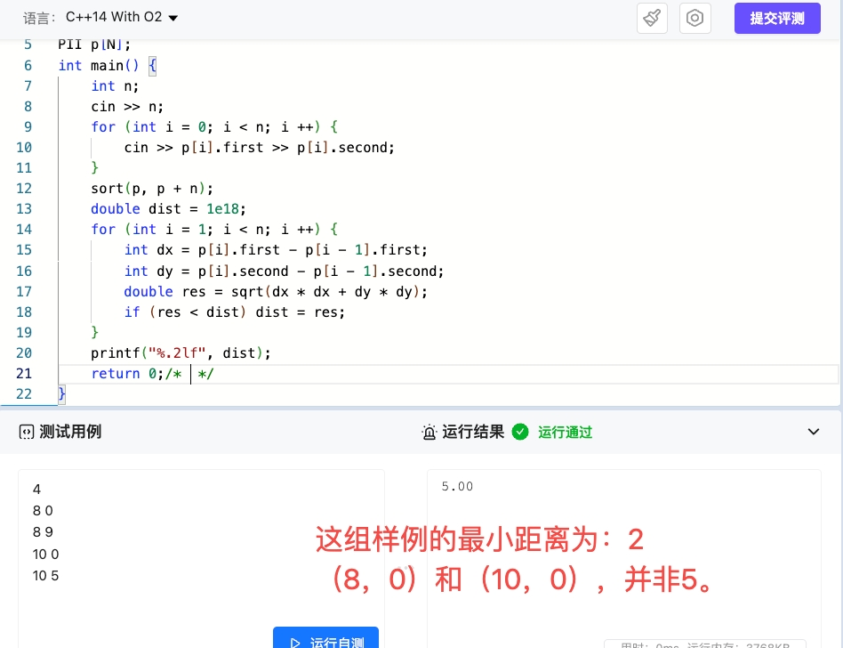

# 核桃第70周周赛纪实
## 第一题：红蓝引线
**题目链接**：https://htoj.com.cn/cpp/oj/problem/detail?pid=22442752994432&cid=22442846180736
### 思路
题目要求红蓝交错出现，那么就有两种情况了。
- 情况一：红蓝红蓝红（假如总共有5根引线）;
- 情况二：红蓝红蓝红蓝（假如总共有5根引线）。
  
综上，红色和蓝色阴线的差值要么为 `0`，要么为 `1`，那么需要增加最少的引线的条数为 `0` 或者 `差值 - 1`。
### 代码
```cpp
#include <bits/stdc++.h>
using namespace std;
int main() {
    int a, b; cin >> a >> b;
    cout << max(0, abs(a - b) - 1);
    return 0;
}
```
## 第二题：坐标分析
**题目链接**：https://htoj.com.cn/cpp/oj/problem/detail?pid=22442753460352&cid=22442846180736&tab=1
### 思路
给定直角坐标系中 `n` 个顶点，让我们求任意两个顶点之间的距离最小值。

使用距离公式：$d = \sqrt{{dx}^2 + {dy}^2}$。
使用**打擂法**求最小值即可。

第一次提交WA的代码：
```cpp
#include <bits/stdc++.h>
using namespace std;
typedef pair<int, int> PII;
const int N = 1e3 + 10;
PII p[N];
int main() {
    int n; 
    cin >> n;
    for (int i = 0; i < n; i ++) {
        cin >> p[i].first >> p[i].second;
    }
    sort(p, p + n);  
    double dist = 1e18;  
    for (int i = 1; i < n; i ++) {
        int dx = p[i].first - p[i - 1].first;
        int dy = p[i].second - p[i - 1].second;
        double res = sqrt(dx * dx + dy * dy);
        if (res < dist) dist = res;  
    }
    printf("%.2lf", dist);  
    return 0;
}
```
错误原因分析：
- 最近点对可能出现在非相邻的点之间（如跳跃的点或 y 坐标接近但 x 坐标不相邻的点）。
- 仅比较相邻点对无法覆盖所有可能的最近点对组合。


优化代码：最后按照分治法，修改一下代码。
```cpp
#include <bits/stdc++.h>
using namespace std;
typedef long long LL;
typedef pair<int, int> PII;
const int N = 1e3 + 10;
const double INF = 1e18;
PII p[N], tmp[N];
double dist(PII a, PII b) {
    LL dx = a.first - b.first;
    LL dy = a.second - b.second;
    return sqrt(dx * dx + dy * dy);
}

double dfs(int l, int r) {
    if (l >= r) return INF;     
    if (l + 1 == r) return dist(p[l], p[r]); 
    int mid = l + r >> 1;
    double d = min(dfs(l, mid), dfs(mid + 1, r));
    int k = 0;
    for (int i = l; i <= r; i ++) {
        LL dx = p[i].first - p[mid].first;
        if (dx * dx < d * d) {
            tmp[k ++] = p[i];
        }
    }
    sort(tmp, tmp + k, [](PII a, PII b) {
        return a.second < b.second;
    });
    for (int i = 0; i < k; i ++) {
        for (int j = i + 1; j < k && (tmp[j].second - tmp[i].second) < d; j ++) {
            d = min(d, dist(tmp[i], tmp[j]));
        }
    }
    return d;
}

int main() {
    int n; 
    cin >> n;
    for (int i = 0; i < n; i ++) {
        cin >> p[i].first >> p[i].second;
    }
    sort(p, p + n);  
    double ans = dfs(0, n - 1);
    printf("%.2lf", ans);
    return 0;
}
```
这种方法虽然也能把题目写出来，但是这比赛是新手组呀。

最后，暴力枚举两个点即可，虽然没难度，双重$for$循环即可解决。
```cpp
#include <bits/stdc++.h>
using namespace std;
const int N = 1e3 + 10;
int x[N], y[N];
int main() {
    int n; cin >> n;
    for (int i = 0; i < n; i ++) cin >> x[i] >> y[i];
    double ans = INT_MAX;
    for (int i = 0; i < n; i ++)
        for (int j = i + 1; j < n; j ++)
        {
            double dx = x[i] - x[j], dy = y[i] - y[j];
            ans = min(ans, sqrt(dx * dx + dy * dy));
        } 
    printf("%.2lf", ans);
    return 0;
}
```
## 第三题：
**题目链接**：https://htoj.com.cn/cpp/oj/problem/detail?pid=22442753460352&cid=22442846180736&tab=1
### 思路

#### 方法一 指纹法
先说一下，比较笨拙的方法，“指纹”必对法。

先将标准字符串 `s` 当作标准指纹。

如果是`数字字符`则让标准指纹数组 `st`为`1`； 

如果是`英文字符`则让标准指纹数组 `st`为`0`； 

在拓印一下输入字符`str`的指纹类型，这里使用`back_up`数组存储。

最后只用判断一下`st`数组和`back_up`数组对应位置上存储的数值是否相同即可。

代码如下：
```cpp
#include <bits/stdc++.h>
using namespace std;
const int N = 1e3 + 10;
bool isdigit(char c) {
    return c >= '0' && c <= '9';
}
bool ischar(char c) {
    return c >= 'a' && c <= 'z';
}
bool st[N], back_up[N];
int main() {
    string s; cin >> s;
    for (int i = 0; i < s.size(); i ++)
        if(isdigit(s[i])) st[i] = 1;
        else if(ischar(s[i])) st[i] = 0; 
    int n, cnt = 0; cin >> n;
    for (int i = 0; i < n; i ++) {
        memset(back_up, 0, sizeof back_up);
        string str; cin >> str;
        if(str.size() != s.size()) continue;
        int l = str.size();
        for (int i = l - 1; i >= 0; i --)
        {
            if(isdigit(str[i])) back_up[i] = 1;
            else if(ischar(str[i])) back_up[i] = 0; 
        }
        int f = 0;
        for (int i = 0, j = l - 1; i < l && j >= 0; i ++, j --)
            if(st[i] ^ back_up[j]) f = 1;
        if(!f) cnt ++; 
    }
    cout << cnt;
    return 0;
}
```
使用指纹法求解问题，虽然能作对，但是略微有点复杂。

#### 方法二 
此方法建立在对本题数据的漏洞上，因为本题字符串，要么是数字字符，要么是英文字符。

故此，求其两者不如的其中。

只用单独判断一下数字字符 或者 英文字符即可，不需要两个都判断。

代码如下：
```cpp
#include <bits/stdc++.h>
using namespace std;
int cnt;
int main() {
    string s; cin >> s;
    bool f = 0;
    int n; cin >> n;
    for (int i = 0; i < n; i ++)
    {
        string str; cin >> str;
        f = s.size() == str.size();
        // 长度相等才会判断
        for (int i = 0, j = str.size() - 1; i < s.size() && ~j && f; i ++, j --)
            if(isdigit(s[i]) && isalpha(str[j])
            || isdigit(str[j]) && isalpha(s[i])) f = 0;
        cnt += f;
    }
    cout << cnt;
    return 0;
}
```

## 第四题：
**题目链接**：https://htoj.com.cn/cpp/oj/problem/detail?pid=22442756213888&cid=22442846180736&tab=1
### 思路
题目要求我们求出距离当前元素第 `k` 近的数是哪一个，那么可以先用 `dist` 数组先统计一下每个数之间的距离。

使用`sort`函数对距离进行排序，如果距离相同，则按编号升序排序。然后直接选择第`k-1`个元素作为结果。
```cpp
#include <bits/stdc++.h>
using namespace std;
const int N = 1e3 + 10;
typedef pair<int, int> PII;
int a[N], res[N];
int main() {
    int n, k;
    cin >> n >> k;
    for (int i = 0; i < n; i ++) cin >> a[i];
    for (int i = 0; i < n; i ++) {
        vector<PII> dist;
        for (int j = 0; j < n; j ++) {
            if (i != j) dist.push_back({abs(a[i] - a[j]), j + 1});
        }
        sort(dist.begin(), dist.end());
        res[i] = dist[k - 1].second;
    }
    for (int i = 0; i < n; i ++ ) 
        cout << res[i] << " ";
    return 0;
}
```