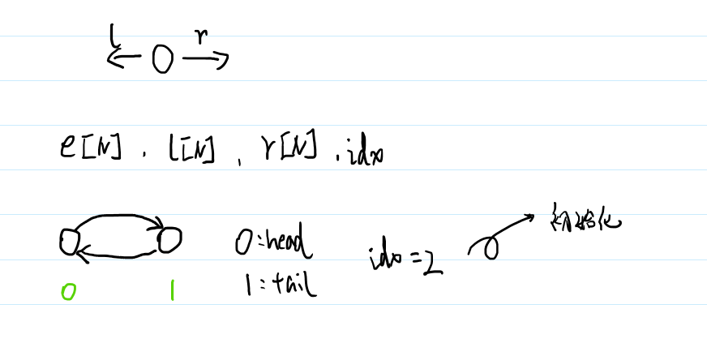

# 使用数组模拟链表的独立函数解析（C++实现）
## 一、为什么需要用数组模拟链表？

在C++中，实现链表最直观的方法是使用指针和动态内存分配（如`new`和`delete`）。然而，在某些场景下，我们可能希望使用数组来模拟链表的行为。主要原因包括：

1. 动态内存分配（如`new`和`delete`）可能会导致内存碎片，特别是在频繁插入和删除操作的场景中。
2. 数组的连续存储方式在某些情况下可以提高缓存命中率，从而提升性能。
3. 在竞赛或某些特定环境中，可能需要避免使用动态内存分配。
## 二、核心
数组模拟链表的核心思想是：用数组来存储链表中的节点，每个节点包含数据和指向下一个节点的"指针"。这里的"指针"实际上是数组的索引，而不是真正的内存地址。

具体来说，我们需要两个数组：
- `data[]`：存储节点的数据
- `next[]`：存储下一个节点的索引

## 三、单链表的实现与解析

单链表包含头节点、数据数组和索引数组，通过索引关联各个节点。下面对每个功能函数进行详细解析：

### 1. 初始化函数
```cpp
const int N = 100010;  // 定义数组的最大长度
int head, data[N], next[N], idx;  // 全局变量

// 初始化链表
void init() {
    head = -1;  // 头节点初始化为空
    idx = 0;    // 从0号位置开始存储节点
}
```
- **head**：头节点索引，-1表示链表为空
- **data[]**：存储节点的值
- **next[]**：存储下一个节点的索引
- **idx**：当前可用的空闲位置

### 2. 头部插入函数
```cpp
// 在链表头部插入值为x的节点
void insert_head(int x) {
    data[idx] = x;      // 存储节点值
    next[idx] = head;   // 新节点指向原头节点
    head = idx++;       // 更新头节点，idx后移
}
```
- 时间复杂度：O(1)
- 操作顺序：存值 → 链接 → 更新头节点

### 3. 指定位置后插入函数
```cpp
// 在第k个插入的节点后插入值为x的节点
void insert(int k, int x) {
    data[idx] = x;       // 存储节点值
    next[idx] = next[k]; // 新节点指向下一个节点
    next[k] = idx++;     // k指向新节点，idx后移
}
```
- k是插入顺序的索引（从0开始）
- 时间复杂度：O(1)
- 操作顺序：存值 → 新节点链接 → 更新前驱节点

### 4. 删除指定位置后节点函数
```cpp
// 删除第k个插入的节点的下一个节点
void remove(int k) {
    next[k] = next[next[k]]; // 跳过待删除节点
}
```
- 时间复杂度：O(1)
- 操作原理：直接修改前驱节点的next指针

### 5. 遍历打印函数
```cpp
// 打印链表中的所有元素
void print() {
    for (int i = head; i != -1; i = next[i]) {
        cout << data[i] << " ";
    }
    cout << endl;
}
```
- 从head开始，沿next指针遍历
- 时间复杂度：O(n)

## 四、双链表的实现与解析

双链表每个节点包含前驱和后继指针，支持双向遍历。

### 1. 初始化函数

```cpp
const int N = 100010;
int e[N], l[N], r[N], idx;  // e[]存值，l[]左指针，r[]右指针

// 初始化双链表
void init() {
    r[0] = 1;  // 0号为左端点，指向右端点
    l[1] = 0;  // 1号为右端点，指向左端点
    idx = 2;   // 从2开始分配节点
}
```
- 0号节点为左端点，1号节点为右端点
- l[]和r[]分别存储前驱和后继节点索引

### 2. 指定位置右侧插入函数

```cpp
// 在节点k的右侧插入值为x的节点
void insert(int k, int x) {
    e[idx] = x;      // 存储节点值
    r[idx] = r[k];   // 新节点的右指针指向k的后继
    l[idx] = k;      // 新节点的左指针指向k
    l[r[k]] = idx;   // k的后继的左指针指向新节点
    r[k] = idx++;    // k的右指针指向新节点，idx后移
}
```
- 在k的右侧插入等价于在k后继的左侧插入
- 插入顺序：存值 → 处理新节点指针 → 更新相邻节点指针

### 3. 删除节点函数

```cpp
// 删除节点k
void remove(int k) {
    r[l[k]] = r[k];  // k的前驱的右指针指向k的后继
    l[r[k]] = l[k];  // k的后继的左指针指向k的前驱
}
```
- 时间复杂度：O(1)
- 删除操作不影响idx，被删节点会被后续插入覆盖

### 4. 遍历打印函数
```cpp
// 打印双链表中的所有元素
void print() {
    for (int i = r[0]; i != 1; i = r[i]) {
        cout << e[i] << " ";
    }
    cout << endl;
}
```
- 从左端点的后继开始遍历到右端点
- 时间复杂度：O(n)

## 三、应用示例


## 四、函数对比与总结

| 操作          | 单链表时间复杂度 | 双链表时间复杂度 |
|---------------|------------------|------------------|
| 头部插入      | O(1)             | O(1)             |
| 指定位置插入  | O(1)             | O(1)             |
| 指定位置删除  | O(1)             | O(1)             |
| 正向遍历      | O(n)             | O(n)             |
| 反向遍历      | 不支持           | O(n)             |

**选择建议：**
- 需要双向遍历时选择双链表
- 仅需单向操作时选择单链表
- 节点数量固定时使用数组模拟
- 节点数量动态变化时使用指针实现

通过这种数组模拟方式，我们避免了动态内存分配，提高了缓存利用率，但需要预先分配足够的空间。

## 五、数组模拟链表的优缺点

### 优点：
1. 避免了频繁的内存分配和释放，减少了内存碎片。
2. 连续存储可能提高缓存命中率，提升性能。
3. 在某些场景下（如竞赛），实现更为简洁。

### 缺点：
1. 需要预先分配较大的数组空间，可能造成浪费。
2. 数组大小固定，无法动态扩展，可能导致空间不足。
3. 实现相对指针链表更为复杂，代码可读性可能较差。

## 六、适用场景

数组模拟链表适用于以下场景：
- 已知节点数量上限，不需要动态扩展。
- 频繁进行插入和删除操作，担心内存碎片。
- 对性能有较高要求，希望利用连续存储的缓存优势。
- 竞赛或特定环境中，需要简洁高效的实现。